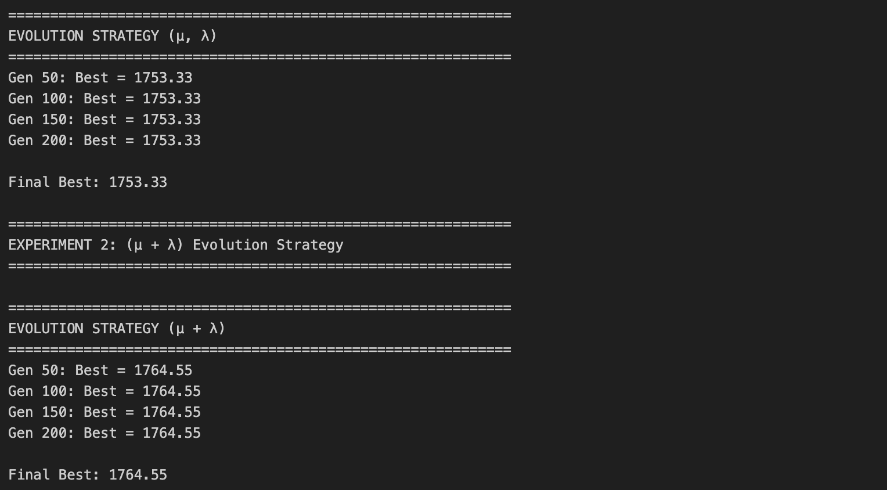
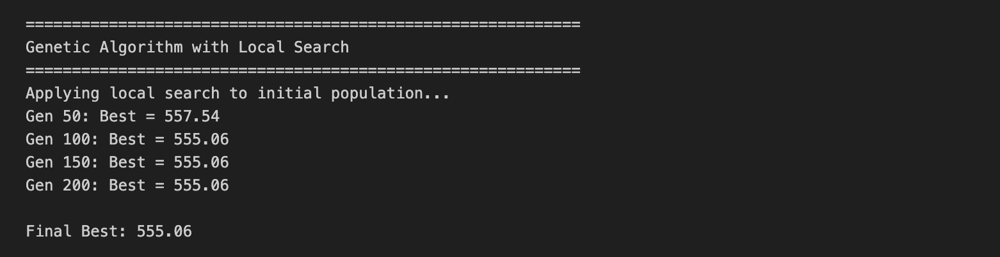

# TSP Solver using Evolutionary Algorithms

This project implements three evolutionary algorithm approaches to solve the Traveling Salesman Problem (TSP).

## Implementations

### 1. `tsp_small.ipynb` - GA with Local search algorithm
- **Best for**: Problems with ≤50 cities
- **Can handle**: Up to 100 cities (~3 minutes runtime)
- **Approach**: Genetic Algorithm with 2-opt local search
- **Trade-off**: Slower but finds better solutions

### 2. `tsp.ipynb` - Basic Genetic Algorithm
- **Best for**: Problems with ≥100 cities
- **Approach**: Standard GA without local search, but with different parameters
- **Optimal Configuration**:
  - Mutation: Insert mutation
  - Crossover: Order crossover (OX)
  - Selection: Tournament selection
  - Initialization: Mixed (30% greedy, 70% random)
- **Trade-off**: Faster but may find suboptimal solutions

### 3. `tsp_es.ipynb` - Evolution Strategy
- **Best for**: Problems with ≥100 cities
- **Approach**: both (μ + λ) and (μ, λ) ES approaches
- **Optimal Configuration**:
  - Selection: Uniform parent selection
  - Initialization: Mixed (30% greedy, 70% random)
  - Mutation: Inversion mutation
  - Crossover: Order crossover (OX)
- **Trade-off**: Faster, results similar with GA

## Key Findings

All three implementations use **mixed initialization** (combining greedy nearest-neighbor and random solutions) for optimal starting population quality and diversity.

For large problems (100+ cities), **GA and ES perform similarly** with different operators. The choice between them depends on computational budget and desired solution quality.

## Some of the Results

### Problem: `problem_r1_500.npy` (500 cities)

**Genetic Algorithm**:

**Evolution Strategy**:

### Problem: `problem_r1_50.npy` (50 cities)

**GA with Local Search (GA + 2-opt)**:

## Usage

Choose the appropriate notebook based on your problem size:
- **Small problems (≤50 cities)**: Use `tsp_small.ipynb` for best results
- **Large problems (≥100 cities)**: Use `tsp.ipynb` or `tsp_es.ipynb` for faster runtime

## REVIEW:
The code is well presented and clear, easy to understand. 
In my opinion 3 different solutions are too much, probably it would be better to have a single solution adaptive for the number of cities. Like an algorithm that if the cities are 50< use tsp_small the other one if the number increase. 

The tsp_small converge fast, it probably is a good think, but if you really need just 50 generations to find one of the best solutions probably something is wrong. In your tests and in mines too after the 50 generations the solution doesn't improve, it can be that the cities in this type of problems are limited but you can try to let the initialization to be full random, because one problem could be that using all this local-search limits a lot your exploration. Another idea could be to change the way that you use for the mutation, reversing the order is a good strategies but using it also keep the majority of the edges, so again very good for exploitation, not for exploration.

For the others two approaches, the GA seem to work a litte bit better. Here my doubts are also the fact that I probably prefer a full random initialization, but with more cities a part of the greedy one make sense, and the fact that when you create the population you either make a crossover or make a mutation, you can try to mutate the child after the crossover. Both of the problems converge also really fast, here again could be a problem of not enough exploration, hard to tell.